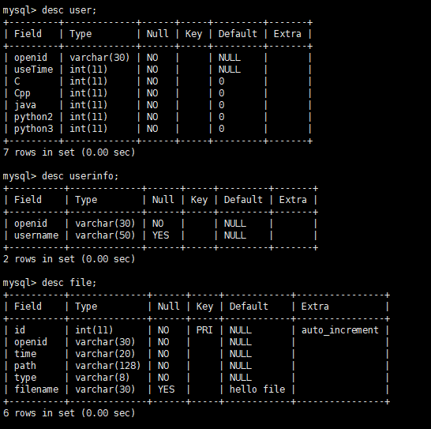

# Easy Compiler's backend
 an online compiler with node.js
 the frontend rep: [easy compiler frontend](https://github.com/boboceng/cppp)
 it run with weapp, a platform by wechat,tencent.
+ before run:
   + install node.js and npm
   + run `npm install` ,if have something else need to install, use npm to install 
   + I have delete the conf dir , you should make it by yourself:
      + `mkdir conf` 
      + `vim db.js`:
        + ```javascript
            module.exports = {
                mysql:{
                    host:'127.0.0.1'(use your own address),
                    user:$yourdbUserName,
                    password:$yourPassword,
                    database:'compiler',
                    port:3306(use your own port)
                }
            }
          ```
     + create the database compiler
        + `create database compiler`
        + `use compiler`
        + create the tables like below
        

+ run:
   + `npm start` 

